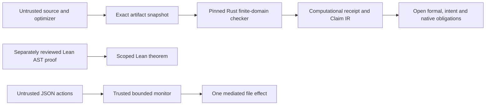

# Scoped assurance across untrusted optimization, artifact evidence and bounded control

Private technical draft for independent review; not a published preprint and not a novelty claim.

## Abstract

We implement a versioned evidence boundary connecting a proof-carrying scientific workflow system to a separately maintained pure bitvector optimizer. The optimizer remains untrusted. A pinned independent Rust checker exhaustively replays supported finite domains, binds exact package bytes and reports residual proof obligations. Computational evidence is represented in the existing claim IR while formal authority remains blocked. A proposal-only runtime monitor admits one bounded file effect and rejects bypass attempts. Separate Lean proofs bind a concrete optimization's complete ASTs and prove resource-bounded shift evaluation preserves the mathematical semantics. This work does not prove arbitrary Rust/Lean refinement, general natural-language meaning preservation, unrestricted agent safety or native compilation correctness.

## Architecture and threat model

The Rust parser/interpreter/checker, SHA-256 implementation, reviewed checker build and operating-system process isolation are trusted for the computational result. Lean theorem dependencies are emitted explicitly; the bitvector equivalence uses the documented code-generator trust of Lean.ofReduceBool. The monitor assumes all effects pass through its trusted interface and observations/logging are faithful. Recomputed hashes alone do not make a false candidate admissible. Untrusted records cannot register a verifier or grant scientific authority.

## Results and reproduction

The campaign preserves the 40-source-theorem ProofLab benchmark with module holdout 22 training, 8 validation and 10 evaluation targets from one project. This is source indexing, not proof generation or external generalization. The Python suite and compiled authority fixtures separately check implementation behavior. The core adversarial suites rejected 25/25 and 12/12 targeted attacks. The optimizer demo independently checks all 65,536 u8 input pairs, reduces AST nodes 7→3, and rejects the fully rehashed malicious optimization. The existing seven-package attack suite rejects 7/7. A fresh seed-20261008 binary-operation experiment compares 162 Rust/Lean executions across u8/u16/u32/u64, with zero mismatches after repairing both the Rust shift-count truncation and Lean huge-shift resource failure. This is testing, not a refinement theorem.

The separate Lean AST equivalence and output-specification proofs and the two shift-preservation theorems are actual checked source. They are new additions to this repository; neither the bitvector identity nor reference-monitor architecture is presented as novel mathematics.

Replayed learned repair evaluation on the existing public synthetic 18-task holdout solves 9/18 (all 9 repairable) with 48 checker calls, versus 9/18 with 63 calls for original order and 7/18 with 64 calls for seeded random. The public multi-step benchmark solves 18/18 with 102 calls for learned ranking, 18/18 with 240 for original order and 15/18 with 387 for seeded random. Source-guided and hybrid baselines solve 18/18 with 54 calls; literal source copying solves 18/18 with 36. Thus the learned approach does not outperform the strongest information-rich baseline. These tasks are public, synthetic and not independent external projects. Public source copying is an explicit leakage/information baseline, not a research discovery. No confidence interval is assigned to deterministic, correlated, targeted examples. No historical 527-case CertiForge result was found or recreated under that name.

Run the scripts documented in CERTIFORGE_ADAPTER_V1.md, CertiForge/scripts/differential_replay.py, website/scripts/train_semantic_repair_policy.mjs and website/scripts/benchmark_multistep_repair.mjs. Exact commits, seeds, toolchains, all emitted outcomes and file hashes belong in the validation manifest. The final campaign report supersedes any preliminary counts in this draft.

## Related work and review requirements

Proof-Carrying Code (Necula, POPL 1997) already separates an untrusted producer from proof checking. Foundational PCC (Appel, LICS 2001) emphasizes a small trusted base. CompCert (Leroy, CACM 2009) proves compiler preservation; this system does not provide an equivalent native compilation theorem. Alive2 (Lopes et al., PLDI 2021) performs LLVM translation validation; our result concerns a substantially smaller finite pure IR. Stochastic superoptimization and equality saturation already explore candidate rewrites; independent admission rather than discovery is the relevant boundary. Lean's existing BV decision procedure supplies the underlying proof-producing SAT/LRAT machinery. Reference monitors and proof-carrying authorization are established approaches to mediation, not inventions of this campaign.

These comparisons are grounded in the repository's literature audit and identifiable primary publications. A fresh exhaustive literature search, citation verification, independent evaluation and external review remain OPEN. The strongest supported contribution is a concrete integration with explicit non-promotion of bounded computational evidence and reproducible negative controls, together with narrowly scoped checked bridge examples. A claimed breakthrough or general alignment guarantee is unsupported.

## Unsolved obligations

Actual semantic checker source/fixtures are absent; Rust/package-to-Lean refinement, general certificate admission, native execution preservation, scientific-intent interpretation and external-family evaluation remain open. Publication also requires source/data/model rights, full disclosure-surface audit, provider credential isolation/rotation, actual required CI enforcement and independent reviewer acceptance.
