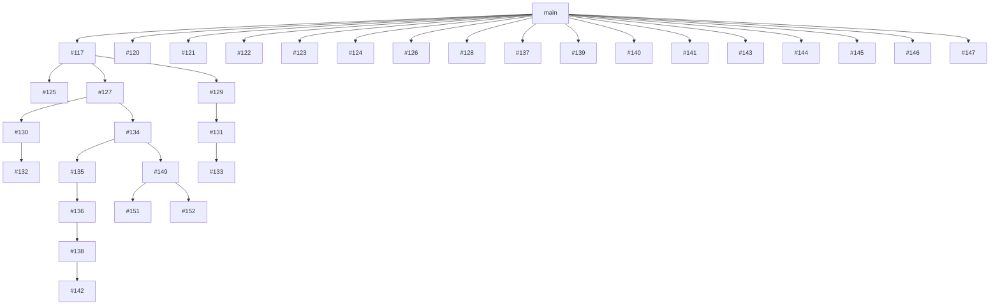

# Frozen PR dependency graph

Baseline main: `fabc704efdbda4c8822881366e4db3d3e31f066a`.

```mermaid
graph TD
  main["main"]
  main --> pr117["#117"]
  main --> pr120["#120"]
  main --> pr121["#121"]
  main --> pr122["#122"]
  main --> pr123["#123"]
  main --> pr124["#124"]
  pr117 --> pr125["#125"]
  main --> pr126["#126"]
  pr117 --> pr127["#127"]
  main --> pr128["#128"]
  pr117 --> pr129["#129"]
  pr127 --> pr130["#130"]
  pr129 --> pr131["#131"]
  pr130 --> pr132["#132"]
  pr131 --> pr133["#133"]
  pr127 --> pr134["#134"]
  pr134 --> pr135["#135"]
  pr135 --> pr136["#136"]
  main --> pr137["#137"]
  pr136 --> pr138["#138"]
  main --> pr139["#139"]
  main --> pr140["#140"]
  main --> pr141["#141"]
  pr138 --> pr142["#142"]
  main --> pr143["#143"]
  main --> pr144["#144"]
  main --> pr145["#145"]
  main --> pr146["#146"]
  main --> pr147["#147"]
  pr134 --> pr149["#149"]
  pr149 --> pr151["#151"]
  pr149 --> pr152["#152"]
```

Every edge records the frozen base branch, not a semantic subsumption claim.
